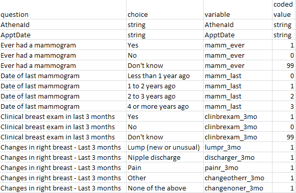
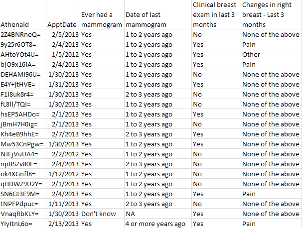
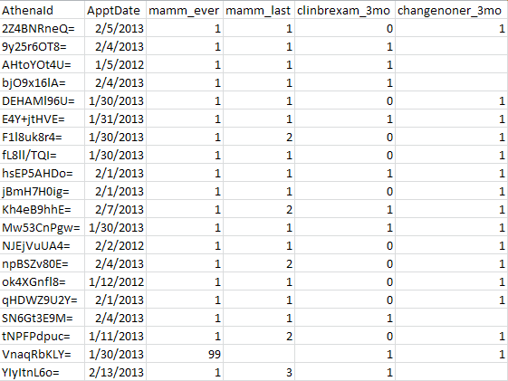

# athenapy Readme

## Description

A toolkit for developing and deploying Python applications for the [UC Athena](http://athenacarenetwork.org/) project.

## Requirements

An environment which includes Python (version [2.6](http://www.python.org/download/releases/2.6.8/) recommended). Git is recommended for development.

## Installation

```bash
git clone http://github.com/gittaylor/athenapy.git
cd athenapy
```

## Usage

```bash
athenapy-run.py <function> <data dictionary file> <survey data file> <output file>
```

example:

```bash
athenapy-run.py convert conversion_HQS_SFMR.csv AthenaDataExport.csv AthenaDataExportSFMR.csv
```

Depending on your environment, you may have to explicitly call the Python executable

Windows

```bash
/c/Python26/python.exe athenapy-run.py convert conversion_HQS_SFMR.csv AthenaDataExport.csv AthenaDataExportSFMR.csv
```

Linux

```bash
python2.6  athenapy-run.py convert conversion_HQS_SFMR.csv AthenaDataExport.csv AthenaDataExportSFMR.csv
```

or (if your Linux system only has Python 2.6 installed)

```bash
python  athenapy-run.py convert conversion_HQS_SFMR.csv AthenaDataExport.csv AthenaDataExportSFMR.csv
```

This call method will be used for the rest of the examples here.

## Example file formats

### Conversion file



### Survey Data Input file



### Coded Data Output file



## Testing

### Running Unit Tests

Linux

```bash
python tests.py
```

If this returns

```bash
$ python tests.py
.
----------------------------------------------------------------------
Ran 1 test in 0.0XXs

OK
```

Then the unit test was successful.

### Convert Using Test Files

```bash
python athenapy-run.py convert conversion_HQS_SFMR.csv testdata/AthenaDataExportTest.csv testdata/AthenaDataExportSFMR.csv 
```

If you end up with a file in testdata called ```AthenaDataExportSFMR.csv``` and it's in SFMR format, then this test was successful.

### Testing With A Salesforce Export

Log into your Athena Salesforce instance, and go to the Questionnaire Data Export page.

Choose Export Options: All Participant Data and Questionnaire Responses

Choose starting and ending dates (exports are limited to a certain number of surveys, so this may have to be a short period)

Leave all other defaults as they are (Local file name, Delimiter)

Click Export

You will be asked to save a file called AthenaDataExport.csv. Save it in the same location as you installed athenapy above.

Now try the following commands to convert the survey data

To SFMR format:

```bash
python athenapy-run.py convert conversion_HQS_SFMR.csv AthenaDataExport.csv AthenaDataExportSFMR.csv 
```

To CDCG format:

```bash
python athenapy-run.py convert conversion_HQS_CDCG.csv AthenaDataExport.csv AthenaDataExportCDCG.csv 
```